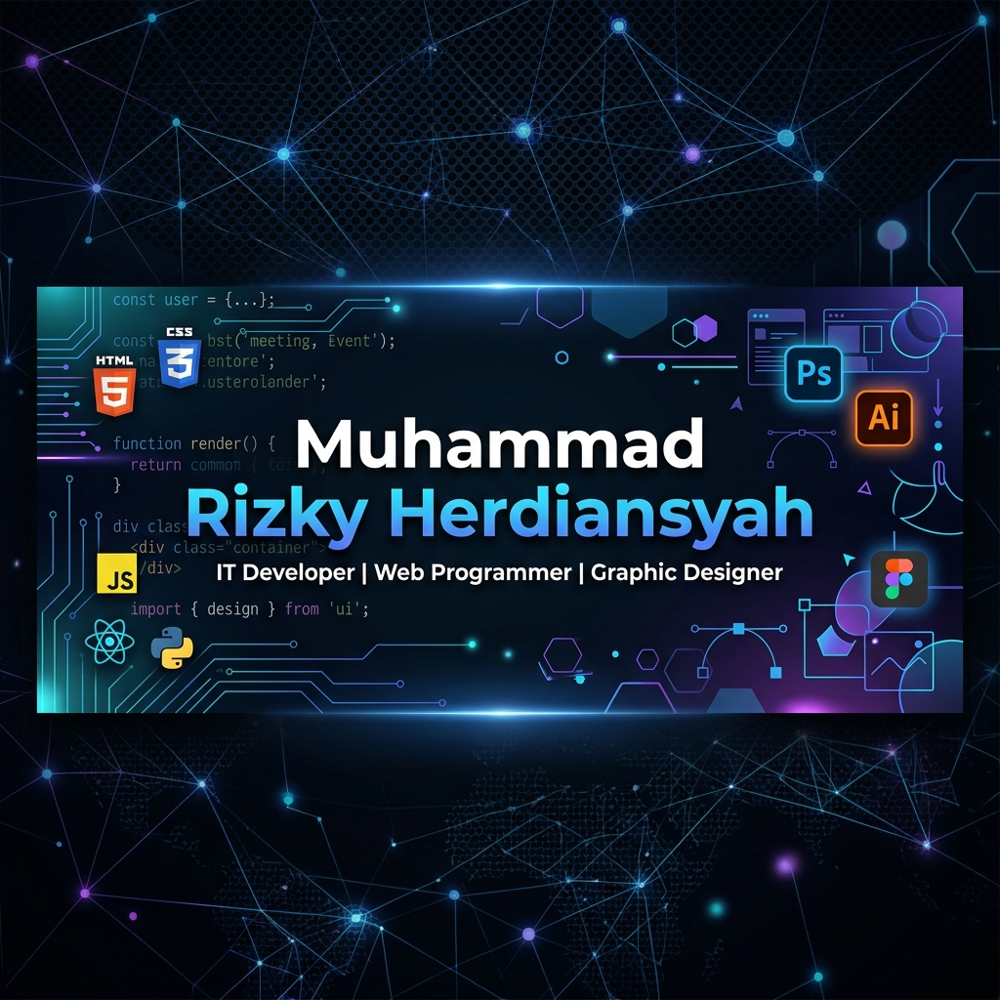

  

<h1 align="center">Hi 👋, I'm Muhammad Rizky Herdiansyah</h1>

  <strong>IT Developer | Web Programmer | Graphic Designer | IT Support</strong>

  
  
  

---

### 🎓 About Me

I am a versatile **IT Professional** with nearly **3 years of experience** in the tech industry. My expertise spans across **Web Development**, **IT Infrastructure**, and **Graphic Design**. I enjoy solving complex problems through code and ensuring systems run smoothly and securely.

- 🚀 Currently working as an **IT Developer & IT Support** at PT. Indonesia Telekomunikasi Teknologi.
- 💡 Specialized in **Laravel** ecosystems, **REST API** integration, and **Next.js** for modern web applications.
- 🛠️ Experienced in managing **Server Infrastructure**, **Networking (VPN/Firewall)**, and providing high-level technical support.
- 🎨 Creative mind with a background in **Graphic Design** and **Content Creation**.

---

### 🛠️ Tech Stack & Tools

<table>
  <tr>
    <td valign="top" width="50%">
      <h4>🚀 Development</h4>
      
      
      
      
      
       
      
      
    </td>
    <td valign="top" width="50%">
      <h4>🎨 Design & Creative</h4>
      
      
      
      
    </td>
  </tr>
  <tr>
    <td valign="top" width="50%">
      <h4>🌐 Infrastructure & Support</h4>
      
      
      
      
    </td>
    <td valign="top" width="50%">
      <h4>🧰 Tools</h4>
      
      
      
    </td>
  </tr>
</table>

---

### 📈 GitHub Stats

  

  

  

---

  <i>"I turn complex business needs into efficient, scalable, and visually stunning systems."</i>

  

