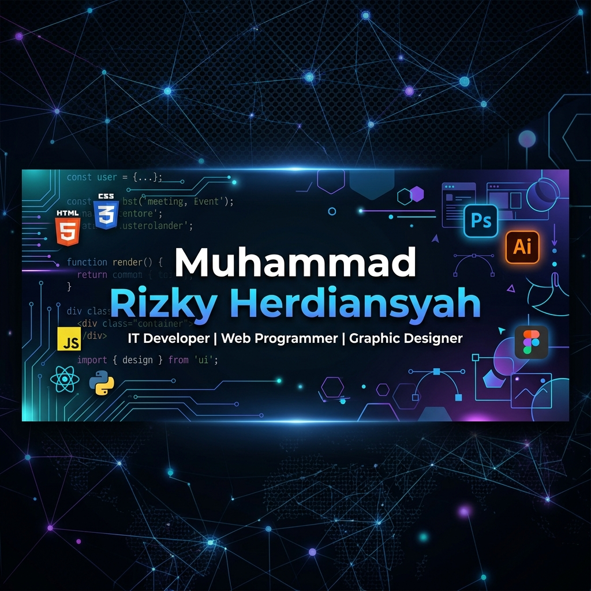

  

<h1 align="center">Hi 👋, I'm Muhammad Rizky Herdiansyah</h1>

  <strong>Full-Stack Developer | Mobile App Developer | IT Support & Infrastructure | Graphic Designer</strong>

  
  
  

 

### 👨‍💻 About Me

I am a results-driven **Full-Stack Developer** & **IT Professional** with nearly 3 years of experience building secure, scalable web & mobile applications and managing IT infrastructure. My primary expertise revolves around the **Laravel & JS/TS Ecosystems**, **Flutter for cross-platform mobile development**, paired with strong system administration and graphic design capabilities.

- 🏢 Currently working as a **Full-Stack Developer** at **PT Indonesia Net (INET)**.
- ⚡ **Core Stack:** PHP (Laravel), Vue.js + Inertia.js, React / Next.js, Flutter (Mobile), Node.js, and RESTful APIs.
- 🗄️ **Databases:** MySQL, PostgreSQL, MS SQL Server, and Redis.
- 🛠️ **Infrastructure & Security:** Linux Server Administration (Ubuntu), Nginx, Networking (VPN/Firewall), & System Security.
- 🎨 **Creative Background:** Graphic Design & Video Editing (Adobe Creative Cloud & Figma).

 

### 🛠️ Tech Stack & Tools

  
  
  
  
  
  
  
  
  

  
  
  
  
  
  
  
  
  

  
  
  
  
  

---

  <i>"Building clean, secure, and production-ready systems — from code to infrastructure."</i>

  

